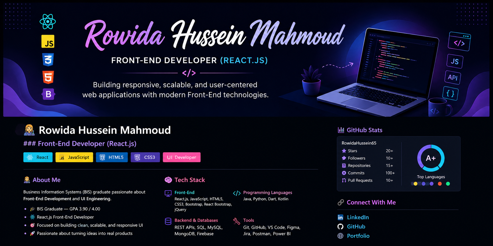

# 👩‍💻 Rowida Hussein Mahmoud  

  

  

---

## 👩‍💻 About Me

Business Information Systems (BIS) graduate passionate about Front-End Development and UI Engineering.

- 🎓 GPA: **3.90 / 4.00**
- ⚛️ React.js Developer  
- 🎯 Focus: Clean UI, Performance, Scalable Apps  
- 🚀 Passionate about building real-world products  

---

## 🧠 Tech Stack

**Front-End:** React.js • JavaScript • HTML • CSS • Bootstrap  
**Tools:** Git • GitHub • Figma • VS Code • Postman  
**Backend Basics:** REST APIs • Firebase • SQL  

---

## 💼 Experience

- 🚀 NTI Front-End Developer Intern  
- 🇪🇬 DEPI Front-End Track  
- 💻 Freelance Web Developer  
- 🏢 Code Alpha Internship  

---

## 🌱 Graduation Project

### ♻️ Phoenix — Sustainability Platform (React.js)

- Built with React + Vite  
- Reusable UI components  
- API integration  
- Focus on UX & responsiveness  

🏆 Distinguished graduation project

---

## 📌 Featured Projects

---

## 📊 GitHub Stats

  

  

---

## 🔗 Connect With Me

  <a href="https://www.linkedin.com/in/rowida-hussein-23032004ro/">LinkedIn</a> • 
  <a href="https://github.com/rowidahussein65">GitHub</a> • 
  <a href="https://rowidahussein65.github.io/Update_myPortfolio/">Portfolio</a>

---

⭐ Thanks for visiting my profile!
